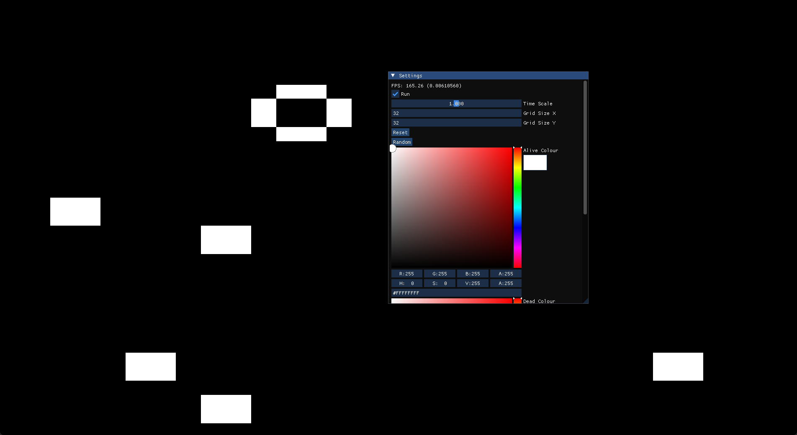

# Conway's Game of Life

An implementation of Conway's Game of Life in C++ using DirectX 11 and [Dear ImGui](https://github.com/ocornut/imgui)

## Controls

- G: Show settings window
- R: Toggle simulation running state

### Building and Running

MSVC (Visual Studio 2022), C++ 20 or newer

Open the solution in Visual Studio 2022 or newer and set the profile to Release x64

Requires a GPU capable of DirectX 11 Graphics API

### Screenshots

